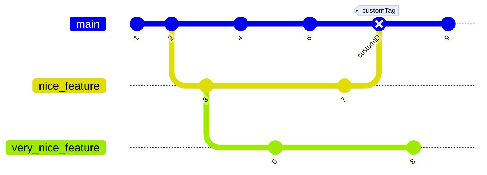

# Zerg Bot

This will be the codebase for our BWAPI bot. This README will outline some agreed upon standards for the collaboration on this project so we do not have to deal with nightmare merges and late night sessions of putting out fires in the code.

## Commit Messages

Here is a basic format for how we should prefix commit messages so our code history is easily trackable if things go wrong.

* `feat` Commits, that adds or remove a new feature
* `fix` Commits, that fixes a bug
* `refactor` Commits, that rewrite/restructure your code, however does not change any API behaviour
* `style` Commits, that do not affect the meaning (white-space, formatting, missing semi-colons, etc)
* `test` Commits, that add missing tests or correcting existing tests
* `docs` Commits, that affect documentation only
* `build` Commits, that affect build components like build tool, ci pipeline, dependencies, project version, ...
* `ops` Commits, that affect operational components like infrastructure, deployment, backup, recovery, ...
* `chore` Miscellaneous commits e.g. modifying `.gitignore`

Thus, commits can look like `feat: new behaviour tree for workers` to indicate that this commit has finished and delivered a pice of work which is a feature. Of course if we forget to use this structure is not the end of the world, but its a good convention that does make it easier for us in scenarios where things go wrong in the changelog.

## Branching

In our case I beleive a feature branching strategy will be best suited, no need for extra dev and staging branches. Feature branches should be enough such that 1 or 2 people could be working on a specific feature branch together and additionally pull straight from main if another feature branch got merged meanwhile.
Below is an example of how these feature branches will look like.

For the naming of branches we can use a similar system to the commit messages where in this case we have for example `feat/worker_behaviour` - we basically just replace the colon which is in the commit message structure.

## Pull Requests

Pull requests wont be super important, but you should set one up at least when you merge in you feature branch to main such that the rest of the team is notified of changes and can update their own feature branches with the new changes to avoid massive git merges in the end.
For code review it wont be very relevant, but it might be nice to add the person you worked on the feature with as a reviewer so they can also give a go-ahead of the merge if they weren't with you when you made the final changes.

For the descriptions of the PRs please just add a very basic bullet-point list of the new classes added and/or major chnages. Such that when people merge in your new stuff they know what could potentially break on their side if they merge in the new stuff since they might be working on a very similar sub-unit of the system.

## Code Consistency

No need to go full anal about code consistency but keep it more or less the same as the rest of the code in terms of formatting and style, since there are points to be gained from the coursework in terms of readability.
